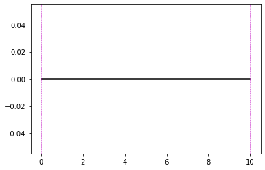
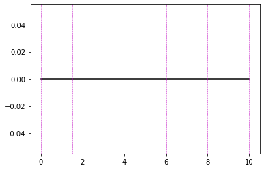
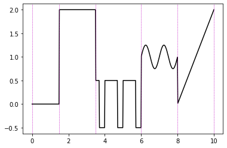
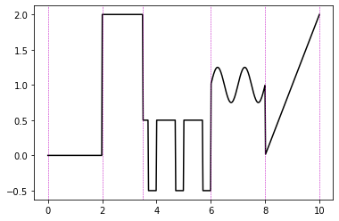
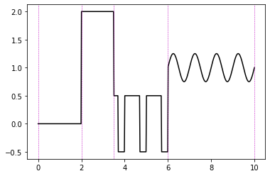
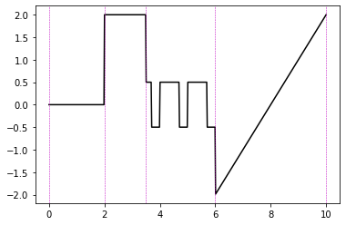

Import Signal Builder and create an instance of the SignalBuilder class.


```python
from SignalBuilder import SignalBuilder
S = SignalBuilder()
```

Set the start and end time of the signal. These values can be changed later if desired.

We'll also set a sample frequency, although this can be set later if desired.


```python
start_time = 0
end_time = 10
S.signalStart = start_time
S.signalEnd = end_time

freq = 50
S.sampleFrequency = freq
```

You can check the structure of the signal thus far using the **report** function


```python
S.report()
```

    Start Node:
        <SignalBuilder.builder.Node object at 0x10dc01c18>
        time: 0
    ----
    
    Piece:
        <SignalBuilder.builder.Piece object at 0x10dc93080>
        Type: constant
    ----
    
    End Node:
        <SignalBuilder.builder.Node object at 0x10dc01eb8>
        time: 10
    ----
    


By default, there are three objects present in out signal chain: two nodes and a piece.
The two nodes are start and end nodes whose order cannot be changed.
SignalBuilder creates pieces between every two nodes in a chain that represent functions which can be
modified at any time. The default function for a piece is a constant.

Let's use Matplotlib to visualize what's going on.


```python
import matplotlib as mpl
import matplotlib.pyplot as plt
import numpy as np
%matplotlib notebook

num_samples = (end_time - start_time) * freq
t = np.linspace(start_time, end_time, num=num_samples)
    
def show_signal():
    t, Y, nodes = S.genPiecew()
    plt.plot(t, Y, '-', color='k')
    for xc in nodes:
        plt.axvline(x=xc, linewidth=0.5, linestyle='--', color='m')
    plt.show()
```


```python
show_signal()
```





The vertical dotted line represents the location of the nodes present in the signal, which right now are the start and end nodes.

You can start adding in nodes using the **insertNode** method:
```python
insertNode(index, t=None):
```
Where index is the node location in reference to the other nodes, and t is the time value of the node.


```python
S.insertNode(1, 1.5)
S.insertNode(2, 3.5)
S.insertNode(3, 6)
S.insertNode(4, 8)
```

Looking at the report, our signal now looks like this:


```python
S.report()
```

    Start Node:
        <SignalBuilder.builder.Node object at 0x10dc01c18>
        time: 0
    ----
    
    Piece:
        <SignalBuilder.builder.Piece object at 0x10dc93080>
        Type: constant
    ----
    
    Node:
        <SignalBuilder.builder.Node object at 0x1c1ed80d68>
        time: 1.5
    ----
    
    Piece:
        <SignalBuilder.builder.Piece object at 0x1c1ed80e80>
        Type: constant
    ----
    
    Node:
        <SignalBuilder.builder.Node object at 0x1c1ed80438>
        time: 3.5
    ----
    
    Piece:
        <SignalBuilder.builder.Piece object at 0x1c1ed80e48>
        Type: constant
    ----
    
    Node:
        <SignalBuilder.builder.Node object at 0x1c1dcdeb00>
        time: 6
    ----
    
    Piece:
        <SignalBuilder.builder.Piece object at 0x1c1ed80470>
        Type: constant
    ----
    
    Node:
        <SignalBuilder.builder.Node object at 0x1c1ed80b00>
        time: 8
    ----
    
    Piece:
        <SignalBuilder.builder.Piece object at 0x1c1ed80ef0>
        Type: constant
    ----
    
    End Node:
        <SignalBuilder.builder.Node object at 0x10dc01eb8>
        time: 10
    ----
    


```python
show_signal()
```





We can now grab those pieces and modify each one as we wish.


```python
pieces = S.pieces
pieces[1].func.setValue(2)
pieces[2].fType = 'square'
pieces[2].func.setAmplitude(0.5)
pieces[2].func.setDutyCycle(0.7)
pieces[3].fType = 'sinusoid'
pieces[3].func.setAmplitude(0.25)
pieces[3].func.setVShift(1)
pieces[4].fType = 'ramp'
pieces[4].getFunc().setTimeRange([8, 10])
```


```python
show_signal()
```





To move a node, use the **setNodeTime** method
```python
setNodeTime(index, t)
```
Where *index* is the node index and *t* is the new time


```python
S.setNodeTime(1, 2)
show_signal()
```





You can also delete nodes using the **deleteNode** method. 
```python
deleteNode(index, right=True)
```
The method will also automatically remove a piece and re-link the chain.


```python
S.deleteNode(4)
show_signal()
```





By default, the piece to the right of the piece is deleted.

This can be changed by setting the **right** flag to **False**


```python
S.deleteNode(4, False)
show_signal()
```




